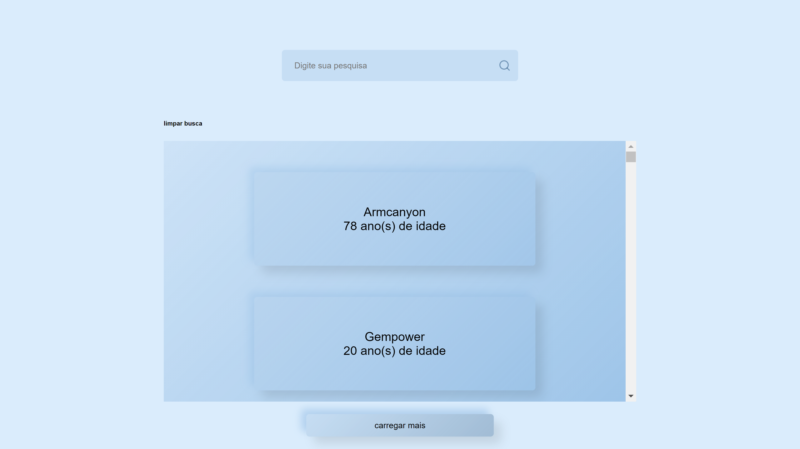
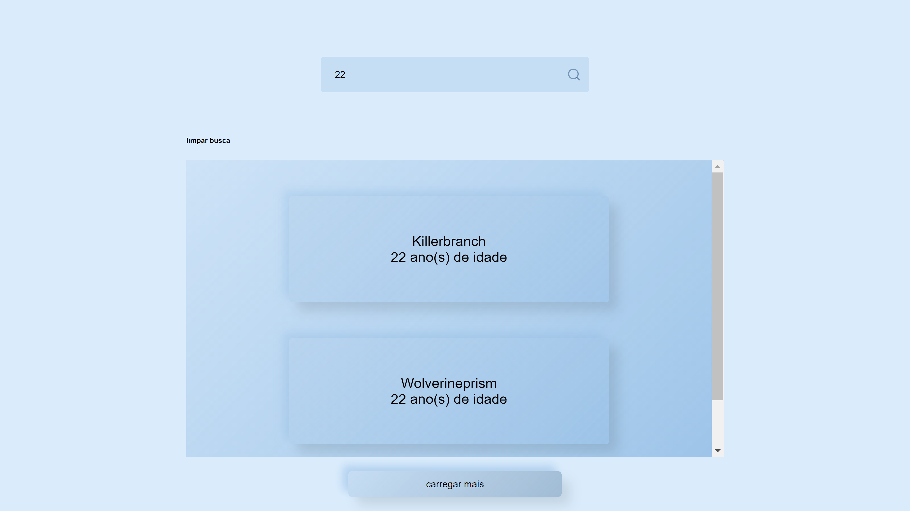

# SeeAllUsers
 
An interface to see all users and search users! Have an Good experience :D

## Prerequisites
1ª Yarn
2ª Node.JS
3ª Browser (Google Chrome, Mozilla FireFox, Opera...)

In the project directory, you can run:

### `yarn start`

Runs the app in the development mode. 
Open [http://localhost:3000](http://localhost:3000) to view it in the browser.
